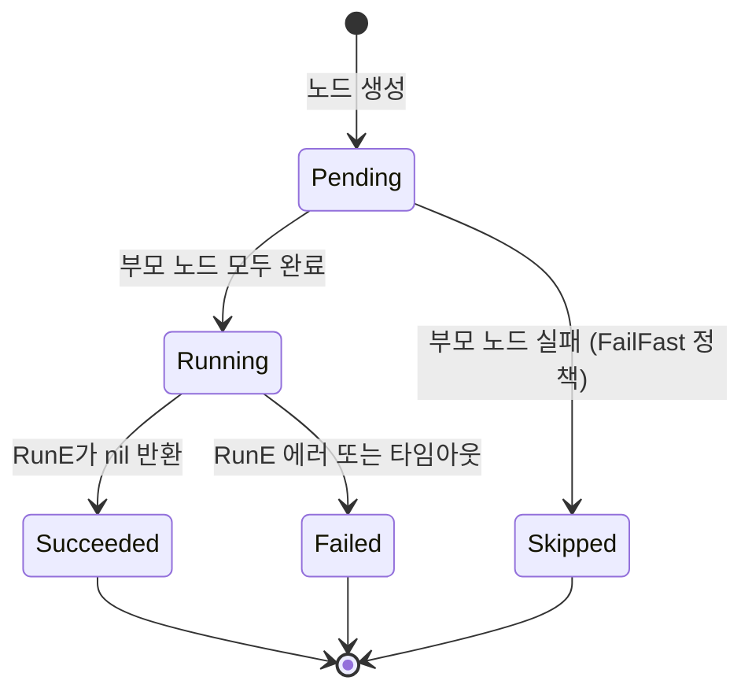

# dag-go

[](https://github.com/HeaInSeo/dag-go/actions/workflows/test.yml)
[](https://github.com/HeaInSeo/dag-go/actions/workflows/lint.yml)
[](https://pkg.go.dev/github.com/HeaInSeo/dag-go)

**dag-go**는 순수 Go로 작성된 동시성 DAG(방향 비순환 그래프) 실행 엔진입니다.
태스크를 노드로, 의존 관계를 방향 엣지로 정의하면 전체 그래프를 동시에 실행합니다.
컨텍스트 취소, 노드별 타임아웃, 사이클 감지, 원자적 상태 전이를 기본 제공합니다.

English documentation: [README.md](README.md)

---

## 주요 기능

| 기능 | 설명 |
|---|---|
| **순수 Go** | Kubernetes·외부 프레임워크 의존 없음. stdlib + 최소 의존성 |
| **컨텍스트 연동** | 모든 `Runnable.RunE`에 `context.Context` 전달; 취소 시그널이 그래프 전체로 전파 |
| **데드락 안전 동시성 캡** | `WorkerPoolSize`는 RunE 실행(`inFlight`)만 제한. 의존성 대기(`preFlight`)는 슬롯을 점유하지 않아 어떤 값이어도 데드락 불가 |
| **라이프사이클 가드레일** | `FinishDag()` 성공 후 `AddEdge`/`SetContainerCmd`/`SetNodeRunner` 호출 시 에러 반환 |
| **원자적 `FinishDag`** | 사이클 감지가 구조 변경 이전에 실행; 실패 시 DAG 상태 불변 |
| **사이클 감지** | DFS 기반, `ErrCycleDetected` 센티넬 반환 (`errors.Is` 호환) |
| **원자적 상태 전이** | `TransitionStatus(from, to)` CAS로 잘못된 상태 전이 방지 |
| **노드별/DAG 수준 타임아웃** | `Node.Timeout` 또는 `DagConfig.DefaultTimeout`; 타임아웃은 실행 슬롯 획득 후부터 카운트 |
| **에러 정책** | `FailFast`(기본) 또는 `ContinueOnError`; 런타임 에러는 `Dag.Errors` 채널에 기록 |
| **SafeChannel\[T\]** | 제네릭 동시성 안전 채널 래퍼, double-close 패닉 방지 |
| **고루틴 누수 검증** | 모든 테스트에서 `goleak`으로 고루틴 누수 0건 확인 |
| **Reset & 재시도** | `Reset()`으로 실행 상태 초기화; 같은 토폴로지를 새 러너로 재실행 가능 |

---

## 설치

```bash
go get github.com/HeaInSeo/dag-go
```

**Go 1.25 이상** 필요.

---

## 빠른 시작

```go
package main

import (
    "context"
    "errors"
    "fmt"
    "time"

    dag "github.com/HeaInSeo/dag-go"
)

type MyRunner struct{ label string }

func (r *MyRunner) RunE(ctx context.Context, _ interface{}) error {
    select {
    case <-time.After(50 * time.Millisecond):
        fmt.Printf("[%s] 완료\n", r.label)
        return nil
    case <-ctx.Done():
        return ctx.Err()
    }
}

func main() {
    // 1. 초기화 — 시작 노드(start_node) 생성
    d, err := dag.InitDag()
    if err != nil {
        panic(err)
    }

    // 2. 기본 러너 설정
    d.SetContainerCmd(&MyRunner{label: "기본"})

    // 3. 다이아몬드 그래프 구성:
    //    start → A → B1 ─┐
    //                B2 ─┴→ C → end
    _ = d.AddEdge(dag.StartNode, "A")
    _ = d.AddEdge("A", "B1")
    _ = d.AddEdge("A", "B2")
    _ = d.AddEdge("B1", "C")
    _ = d.AddEdge("B2", "C")

    // 4. 그래프 봉인. 사이클 감지가 여기서 실행됨.
    //    이후 AddEdge/CreateNode 호출은 에러를 반환.
    if err := d.FinishDag(); err != nil {
        if errors.Is(err, dag.ErrCycleDetected) {
            panic("그래프에 사이클이 있습니다")
        }
        panic(err)
    }

    ctx := context.Background()

    // 5–7. 러너 연결, 실행 준비, 시작
    d.ConnectRunner()
    d.GetReady(ctx)
    d.Start()

    // 8. 모든 노드 완료까지 대기
    if ok := d.Wait(ctx); !ok {
        fmt.Println("DAG 실행 중 에러 발생")
        return
    }

    fmt.Printf("완료 — 진행률: %.0f%%\n", d.Progress()*100)
}
```

---

## DAG 라이프사이클

```
InitDag() / StartDag()       시작 노드 생성
        │
AddEdge(from, to)             부모 → 자식 의존성 등록
        │
FinishDag()                   유효성 검사 → 사이클 감지 → 그래프 봉인
        │                     ← 이후 AddEdge / CreateNode / SetContainerCmd 거부
ConnectRunner()               각 노드에 러너 클로저 연결
        │
GetReady(ctx)                 실행 세마포어 초기화, 노드별 고루틴 실행
        │
Start()                       시작 노드에 트리거 신호 전송
        │
Wait(ctx)                     모든 노드 상태 스트림 fan-in, 성공 시 true 반환
        │
Reset()                       실행 상태 초기화; 토폴로지 보존, 재실행 가능
```

---

## 노드 상태 머신

`TransitionStatus(from, to NodeStatus)`로 엄격하게 관리됩니다.
잘못된 전이는 원자적으로 거부됩니다.



---

## 설정 (`DagConfig`)

```go
cfg := dag.DagConfig{
    MinChannelBuffer:  5,               // 노드 간 엣지 채널 버퍼 크기
    MaxChannelBuffer:  100,             // NodesResult / Errors 채널 버퍼 크기
    WorkerPoolSize:    50,              // 동시 RunE 실행 최대 수
                                        // (노드 수보다 작아도 데드락 없음 — 아래 참조)
    DefaultTimeout:    0,               // 노드별 RunE 타임아웃; 0 = 제한 없음
    ErrorDrainTimeout: 5 * time.Second, // collectErrors의 최대 드레인 대기 시간
    ErrorPolicy:       dag.FailFast,    // 또는 dag.ContinueOnError
}
d := dag.NewDagWithConfig(cfg)

// 함수형 옵션 방식:
d = dag.NewDagWithOptions(
    dag.WithTimeout(10 * time.Second),
    dag.WithWorkerPool(20),
)
```

### `WorkerPoolSize`와 데드락 안전성

`WorkerPoolSize`는 **RunE(`inFlight`)** 를 동시에 실행할 수 있는 노드 수만 제한합니다.
의존성 대기(`preFlight`)는 슬롯을 점유하지 않기 때문에, 캡 값이 아무리 작아도 데드락이 발생하지 않습니다.

```
WorkerPoolSize = 1, 체인 DAG (start → A → B → C → end):
  A는 preFlight에서 대기 (슬롯 미점유)
  start 실행 완료 → A의 preFlight 해제
  A가 슬롯 획득 → RunE 실행 → 슬롯 해제
  B가 슬롯 획득 → … 이하 동일
```

`Node.Timeout` / `DefaultTimeout`의 타임아웃 카운트는 슬롯 획득 **이후**부터 시작됩니다.

---

## 라이프사이클 가드레일

`FinishDag()` 성공 이후 그래프와 러너 설정은 동결됩니다:

```go
d.FinishDag()                  // 봉인 완료
d.AddEdge("X", "Y")            // 에러: topology frozen after GetReady
d.SetContainerCmd(r)           // no-op + 에러 로그: frozen after GetReady
d.SetNodeRunner("n", r)        // no-op + 에러 로그: frozen after GetReady
```

동결 구간은 `GetReady` 성공 시점부터 `Reset` 호출까지입니다.
`FinishDag()`가 실패한 경우(예: 사이클 감지) DAG 상태는 변경되지 않으므로 수정 후 재시도 가능합니다.

---

## 노드별 러너 재정의

```go
// 정적 재정의
d.SetNodeRunner("heavy-node", &HeavyRunner{})

// 동적 리졸버: 실행 시점에 노드별로 호출됨
d.SetRunnerResolver(func(n *dag.Node) dag.Runnable {
    if n.ID == "gpu-task" {
        return &GpuRunner{}
    }
    return nil // ContainerCmd로 폴백
})
```

**러너 우선순위 (높음 → 낮음):**
1. 노드별 재정의 (`SetNodeRunner`)
2. DAG 수준 리졸버 (`SetRunnerResolver`)
3. 전역 기본값 (`SetContainerCmd`)

---

## 에러 처리

`FinishDag`는 `errors.Is`와 호환되는 센티넬 에러를 반환합니다:

```go
if err := d.FinishDag(); err != nil {
    if errors.Is(err, dag.ErrCycleDetected) {
        // 그래프에 사이클 존재
    }
}
```

`RunE` 런타임 에러는 `Dag.Errors`(`*SafeChannel[error]`)에 기록되고
`dag_id`, `error` 필드가 포함된 구조화 logrus 로그로 출력됩니다.
`DroppedErrors()`로 에러 채널 백프레셔를 모니터링할 수 있습니다.

노드 수준 에러는 `*NodeError`로 표면화됩니다(`errors.Is`, `errors.As` 모두 지원):

```go
var nodeErr *dag.NodeError
if errors.As(err, &nodeErr) {
    fmt.Println(nodeErr.NodeID, nodeErr.Phase)
}
```

---

## Reset & 재시도

```go
d.Wait(ctx)           // 완료; DAG 동결 (running=false, nodeResult!=nil)
d.Reset()             // 실행 상태 초기화, 토폴로지 보존
d.ConnectRunner()     // 러너 재연결 (필요 시 새 러너 설정 후 호출)
d.GetReady(ctx)
d.Start()
d.Wait(ctx)
```

---

## Mermaid 시각화

```go
dot := d.ToMermaid()  // FinishDag() 이후 호출
fmt.Println(dot)
```

`graph TD` 형식의 Mermaid 플로차트를 출력합니다.
합성 노드(start/end)는 스타디움 도형으로, 노드별 러너 타입이 등록된 경우 레이블에 포함됩니다.

---

## 개발

```bash
# 레이스 디텍터 포함 테스트
make test

# 린트 (golangci-lint v2.11.3, 로컬 바이너리)
make lint

# 커버리지 리포트 (reports/index.html)
make coverage

# 보안 스캔 (gosec + govulncheck, 수동)
make lint-security
make vuln
```

**의존성 정책:** `k8s.io/*`, `sigs.k8s.io/*` 임포트 금지 (`depguard` 적용).

**Pages:**
- 벤치마크 추세: <https://heainseo.github.io/dag-go/dev/bench/>
- 커버리지 리포트: <https://heainseo.github.io/dag-go/coverage/>

---

## 라이선스

[LICENSE](LICENSE) 파일을 참조하세요.
