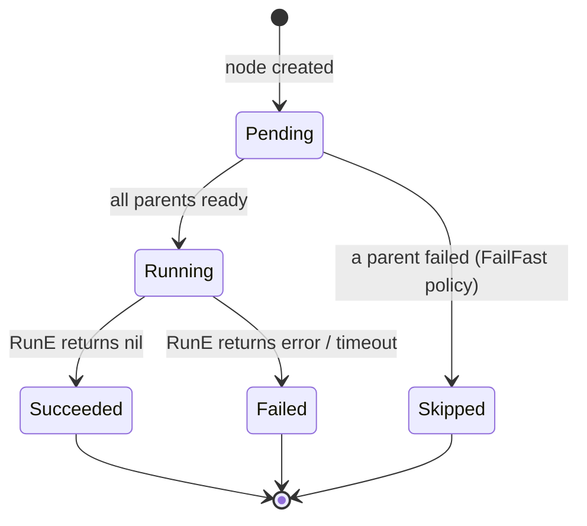

# dag-go

[](https://github.com/HeaInSeo/dag-go/actions/workflows/test.yml)
[](https://github.com/HeaInSeo/dag-go/actions/workflows/lint.yml)
[](https://pkg.go.dev/github.com/HeaInSeo/dag-go)

**dag-go** is a pure-Go concurrent DAG (Directed Acyclic Graph) execution engine.
Wire up tasks as nodes, define dependencies as directed edges, and execute the
entire graph concurrently — with context cancellation, per-node timeouts, cycle
detection, and atomic state-transition guarantees.

한국어 문서: [README.ko.md](README.ko.md)

---

## Key Features

| Feature | Detail |
|---|---|
| **Pure Go** | No Kubernetes or framework dependencies; stdlib + a handful of well-scoped modules |
| **Context-aware execution** | Every `Runnable.RunE` receives `context.Context`; cancellation propagates through the whole graph |
| **Deadlock-safe concurrency cap** | `WorkerPoolSize` bounds only `inFlight` (RunE); dependency wait (`preFlight`) never holds a slot, so any cap value is safe |
| **Lifecycle guardrails** | `FinishDag()` seals the graph; `AddEdge`/`SetContainerCmd`/`SetNodeRunner` return errors after sealing |
| **Atomic `FinishDag`** | Cycle detection runs before any structural mutation; a failed `FinishDag` leaves the DAG unchanged |
| **Cycle detection** | DFS-based, returns `ErrCycleDetected` (sentinel, `errors.Is`-compatible) |
| **Atomic state transitions** | `TransitionStatus(from, to)` CAS guards prevent illegal status overwrites |
| **Per-node & DAG-level timeouts** | `Node.Timeout` or `DagConfig.DefaultTimeout`; timeout budget starts after acquiring the execution slot |
| **Error policy** | `FailFast` (default) or `ContinueOnError`; runtime errors land in `Dag.Errors` channel |
| **SafeChannel\[T\]** | Generic concurrency-safe channel wrapper that prevents double-close panics |
| **Goroutine-leak tested** | Every test verifies zero goroutine leaks with `goleak` |
| **Reset & retry** | `Reset()` restores the DAG to pre-`GetReady` state; reuse the same topology with fresh runners |

---

## Installation

```bash
go get github.com/HeaInSeo/dag-go
```

Requires **Go 1.25+**.

---

## Quick Start

```go
package main

import (
    "context"
    "errors"
    "fmt"
    "time"

    dag "github.com/HeaInSeo/dag-go"
)

type MyRunner struct{ label string }

func (r *MyRunner) RunE(ctx context.Context, _ interface{}) error {
    select {
    case <-time.After(50 * time.Millisecond):
        fmt.Printf("[%s] done\n", r.label)
        return nil
    case <-ctx.Done():
        return ctx.Err()
    }
}

func main() {
    // 1. Initialise — creates the synthetic start node.
    d, err := dag.InitDag()
    if err != nil {
        panic(err)
    }

    // 2. Set a default runner for all nodes.
    d.SetContainerCmd(&MyRunner{label: "default"})

    // 3. Wire a diamond graph:
    //    start → A → B1 ─┐
    //                B2 ─┴→ C → end
    _ = d.AddEdge(dag.StartNode, "A")
    _ = d.AddEdge("A", "B1")
    _ = d.AddEdge("A", "B2")
    _ = d.AddEdge("B1", "C")
    _ = d.AddEdge("B2", "C")

    // 4. Seal the graph. Cycle detection runs here.
    //    After this call, AddEdge/CreateNode are rejected.
    if err := d.FinishDag(); err != nil {
        if errors.Is(err, dag.ErrCycleDetected) {
            panic("cycle found in graph")
        }
        panic(err)
    }

    ctx := context.Background()

    // 5–7. Connect runners, prepare execution, fire.
    d.ConnectRunner()
    d.GetReady(ctx)
    d.Start()

    // 8. Block until all nodes complete.
    if ok := d.Wait(ctx); !ok {
        fmt.Println("DAG execution encountered an error")
        return
    }

    fmt.Printf("All done — progress: %.0f%%\n", d.Progress()*100)
}
```

---

## DAG Lifecycle

```
InitDag() / StartDag()       creates the synthetic start node
        │
AddEdge(from, to)             wires parent → child dependencies
        │
FinishDag()                   validates, detects cycles, then seals the graph
        │                     ← AddEdge / CreateNode / SetContainerCmd rejected after this point
ConnectRunner()               attaches runner closures to every node
        │
GetReady(ctx)                 initialises the semaphore; launches one goroutine per node
        │
Start()                       sends the trigger signal to the start node
        │
Wait(ctx)                     fans-in all node status streams; returns true on success
        │
Reset()                       clears execution state; topology is preserved for re-use
```

---

## Node State Machine

Every node follows a strict lifecycle enforced by `TransitionStatus(from, to NodeStatus)`.
Illegal transitions are atomically rejected.


```mermaid
stateDiagram-v2
    [*] --> Pending : node created
    Pending --> Running  : all parents ready
    Pending --> Skipped  : a parent failed (FailFast policy)
    Running --> Succeeded : RunE returns nil
    Running --> Failed    : RunE returns error / timeout
    Succeeded --> [*]
    Failed    --> [*]
    Skipped   --> [*]
```

---

## Configuration (`DagConfig`)

```go
cfg := dag.DagConfig{
    MinChannelBuffer:  5,               // inter-node edge channel buffer
    MaxChannelBuffer:  100,             // NodesResult / Errors channel buffer
    WorkerPoolSize:    50,              // max concurrent RunE executions
                                        // (safe to set below node count — see below)
    DefaultTimeout:    0,               // per-node RunE timeout; 0 = no limit
    ErrorDrainTimeout: 5 * time.Second, // max time collectErrors waits to drain
    ErrorPolicy:       dag.FailFast,    // or dag.ContinueOnError
}
d := dag.NewDagWithConfig(cfg)

// Functional-option variant:
d = dag.NewDagWithOptions(
    dag.WithTimeout(10 * time.Second),
    dag.WithWorkerPool(20),
)
```

### `WorkerPoolSize` and deadlock safety

`WorkerPoolSize` caps the number of nodes that may execute **RunE** concurrently.
Dependency waiting (`preFlight`) runs in a free goroutine without holding a slot,
so the semaphore cannot deadlock the graph regardless of cap size.

```
WorkerPoolSize = 1, chain DAG (start → A → B → C → end):
  A waits in preFlight (no slot held)
  start runs, completes, releases nothing — A's preFlight unblocks
  A acquires slot → runs RunE → releases slot
  B acquires slot → … and so on
```

A timeout budget (`Node.Timeout` or `DefaultTimeout`) starts ticking **after** a
node acquires its execution slot, so waiting for a slot never consumes the budget.

---

## Lifecycle Guardrails

After `FinishDag()` succeeds, the graph and runner configuration are frozen:

```go
d.FinishDag()                  // seals the graph
d.AddEdge("X", "Y")            // error: topology frozen after GetReady
d.SetContainerCmd(r)           // no-op + error log: frozen after GetReady
d.SetNodeRunner("n", r)        // no-op + error log: frozen after GetReady
```

The frozen window covers from `GetReady` success through `Reset`.
A failed `FinishDag()` (e.g. cycle detected) leaves the DAG unchanged — you may
correct the graph and retry.

---

## Per-Node Runner Override

```go
// Static override.
d.SetNodeRunner("heavy-node", &HeavyRunner{})

// Dynamic resolver: called at execution time per node.
d.SetRunnerResolver(func(n *dag.Node) dag.Runnable {
    if n.ID == "gpu-task" {
        return &GpuRunner{}
    }
    return nil // fall back to ContainerCmd
})
```

**Runner priority (highest → lowest):**
1. Per-node override (`SetNodeRunner`)
2. DAG-level resolver (`SetRunnerResolver`)
3. Global default (`SetContainerCmd`)

---

## Error Handling

`FinishDag` returns typed sentinel errors usable with `errors.Is`:

```go
if err := d.FinishDag(); err != nil {
    if errors.Is(err, dag.ErrCycleDetected) {
        // graph contains a directed cycle
    }
}
```

Runtime errors from `RunE` are written to `Dag.Errors` (`*SafeChannel[error]`)
and logged via structured logrus fields (`dag_id`, `error`).
Use `DroppedErrors()` to detect back-pressure on the error channel.

Node-level errors are surfaced as `*NodeError` (supports both `errors.Is` and `errors.As`):

```go
var nodeErr *dag.NodeError
if errors.As(err, &nodeErr) {
    fmt.Println(nodeErr.NodeID, nodeErr.Phase)
}
```

---

## Reset & Retry

```go
d.Wait(ctx)           // completes; DAG is frozen (running=false, nodeResult!=nil)
d.Reset()             // clears execution state, restores topology for reuse
d.ConnectRunner()     // re-attach runners (optional: set new runners before this)
d.GetReady(ctx)
d.Start()
d.Wait(ctx)
```

---

## Mermaid Visualisation

```go
dot := d.ToMermaid()  // call after FinishDag()
fmt.Println(dot)
```

Outputs a `graph TD` Mermaid flowchart with stadium shapes for synthetic nodes
and per-node runner type labels when registered.

---

## Development

```bash
# Tests with race detector
make test

# Lint (golangci-lint v2.11.3, local binary)
make lint

# Coverage report (HTML at reports/index.html)
make coverage

# Security scan (gosec + govulncheck, manual)
make lint-security
make vuln
```

**Dependency policy:** `k8s.io/*` and `sigs.k8s.io/*` are prohibited (`depguard`).

**Pages:**
- Benchmark trends: <https://heainseo.github.io/dag-go/dev/bench/>
- Coverage report: <https://heainseo.github.io/dag-go/coverage/>

---

## License

See [LICENSE](LICENSE) for details.
