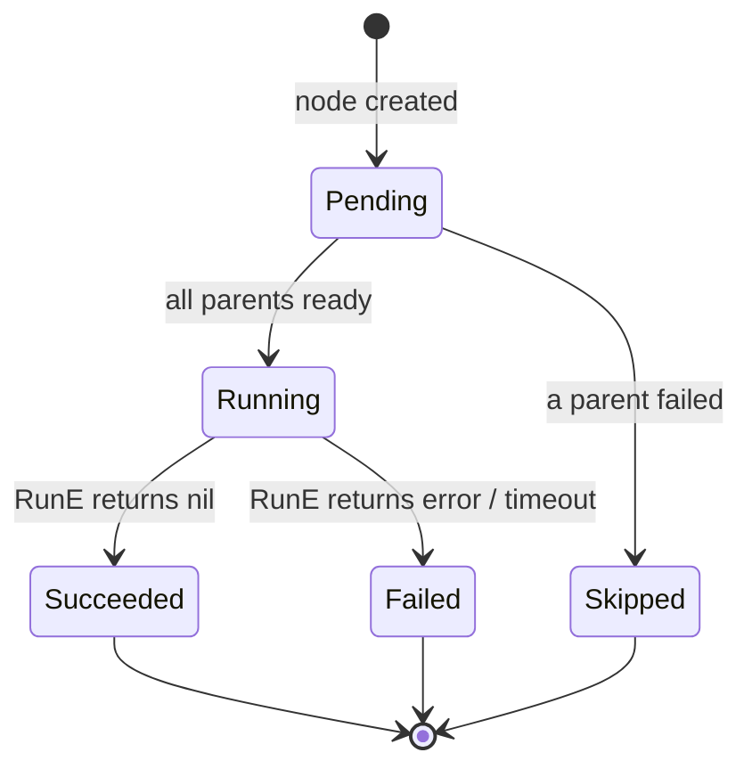

# dag-go

[](https://pkg.go.dev/github.com/seoyhaein/dag-go)
[](https://goreportcard.com/report/github.com/seoyhaein/dag-go)
[](https://www.codefactor.io/repository/github/seoyhaein/dag-go/overview/main)

**dag-go** is a pure-Go concurrent DAG (Directed Acyclic Graph) execution engine.
It lets you wire up arbitrary tasks as nodes, define their dependencies as directed edges,
and execute the entire graph concurrently — with context cancellation, per-node timeout,
cycle detection, and atomic state-transition guarantees built in.

> **API reference (always up-to-date):** [pkg.go.dev/github.com/seoyhaein/dag-go](https://pkg.go.dev/github.com/seoyhaein/dag-go)
>
> All exported symbols carry godoc comments enforced by the `revive:exported` lint rule.
> The generated documentation on pkg.go.dev is the authoritative API reference — no separate
> hand-written docs are maintained.

---

## Key Features

| Feature | Detail |
|---|---|
| **Pure Go** | Zero framework or Kubernetes dependencies; only stdlib + a handful of well-scoped modules |
| **Context-aware execution** | Every `Runnable.RunE` receives `context.Context`; cancellation propagates through the whole graph |
| **SafeChannel\[T\]** | Generic concurrency-safe channel wrapper that prevents double-close panics |
| **Cycle detection** | DFS-based check runs inside `FinishDag`; returns `ErrCycleDetected` (sentinel, `errors.Is`-compatible) |
| **Atomic state transitions** | `TransitionStatus(from, to)` CAS guards prevent illegal status overwrites (e.g. `Failed→Succeeded`) |
| **Worker pool** | Bounded goroutine pool (`DagConfig.WorkerPoolSize`) throttles node execution |
| **Per-node & DAG-level timeouts** | Configure via `Node.Timeout` or `DagConfig.DefaultTimeout`; priority order is respected |
| **Late-binding runners** | `SetNodeRunner` accepts overrides after `GetReady` but before `Start` |
| **Progress tracking** | `Progress()` returns a \[0.0, 1.0\] completion ratio |
| **Goroutine-leak tested** | Every test verifies zero goroutine leaks with `goleak` |

---

## Installation

```bash
go get github.com/seoyhaein/dag-go
```

Requires **Go 1.22+**.

---

## Quick Start

```go
package main

import (
	"context"
	"errors"
	"fmt"
	"time"

	dag "github.com/seoyhaein/dag-go"
)

// MyRunner implements dag.Runnable.
type MyRunner struct{ label string }

func (r *MyRunner) RunE(ctx context.Context, _ interface{}) error {
	select {
	case <-time.After(50 * time.Millisecond): // simulate I/O work
		fmt.Printf("[%s] done\n", r.label)
		return nil
	case <-ctx.Done():
		return ctx.Err()
	}
}

func main() {
	// 1. Initialise — creates the synthetic start node.
	d, err := dag.InitDag()
	if err != nil {
		panic(err)
	}

	// 2. Set a default runner for all nodes (late-binding also supported).
	d.SetContainerCmd(&MyRunner{label: "default"})

	// 3. Wire up a diamond-shaped graph:
	//    start → A → B1 ─┐
	//                B2 ─┴→ C → end
	_ = d.AddEdge(dag.StartNode, "A")
	_ = d.AddEdge("A", "B1")
	_ = d.AddEdge("A", "B2")
	_ = d.AddEdge("B1", "C")
	_ = d.AddEdge("B2", "C")

	// 4. Seal the graph; cycle detection runs here.
	if err := d.FinishDag(); err != nil {
		if errors.Is(err, dag.ErrCycleDetected) {
			panic("cycle found in graph")
		}
		panic(err)
	}

	ctx := context.Background()

	// 5–7. Connect runners, prepare the worker pool, fire.
	d.ConnectRunner()
	d.GetReady(ctx)
	d.Start()

	// 8. Block until all nodes complete.
	if ok := d.Wait(ctx); !ok {
		fmt.Println("DAG execution encountered an error")
		return
	}

	fmt.Printf("All done — progress: %.0f%%\n", d.Progress()*100)
}
```

---

## DAG Lifecycle

```
InitDag()
  └─ StartDag()          creates the synthetic start node
        │
AddEdge(from, to)         wires parent → child dependencies
        │
FinishDag()               seals the graph; connects the end node; runs cycle detection
        │
ConnectRunner()           attaches runner closures to every node
        │
GetReady(ctx)             initialises the worker pool; schedules node goroutines
        │
Start()                   sends the trigger signal to the start node
        │
Wait(ctx)                 fans-in all node status streams; returns true on success
```

---

## Node State Machine (노드 상태 머신)

Every node follows a strict, linearly-ordered lifecycle enforced by
`TransitionStatus(from, to NodeStatus)`.  Illegal transitions
(e.g. `Failed → Succeeded`) are atomically rejected.



---

## Configuration (`DagConfig`)

```go
cfg := dag.DagConfig{
    MinChannelBuffer:  5,              // minimum edge channel buffer size
    MaxChannelBuffer:  100,            // NodesResult channel buffer size
    StatusBuffer:      10,             // per-node status channel buffer
    WorkerPoolSize:    50,             // max concurrent node goroutines
    DefaultTimeout:    30 * time.Second, // preFlight timeout (per-node override takes priority)
    ErrorDrainTimeout: 5 * time.Second,  // max time collectErrors waits to drain the error channel
}

d := dag.NewDagWithConfig(cfg)
```

`dag.DefaultDagConfig()` returns the above defaults.  You can also use the
functional-option API:

```go
d := dag.NewDagWithOptions(
    dag.WithTimeout(10 * time.Second),
    dag.WithWorkerPool(20),
)
```

---

## Per-Node Runner Override

Assign different runners to individual nodes, or use `SetRunnerResolver` for
dynamic selection at execution time:

```go
// Static override before Start.
d.SetNodeRunner("heavy-node", &HeavyRunner{})

// Dynamic resolver: called at execution time for each node.
d.SetRunnerResolver(func(n *dag.Node) dag.Runnable {
    if n.ID == "gpu-task" {
        return &GpuRunner{}
    }
    return nil // fall back to ContainerCmd
})
```

**Runner priority (highest → lowest):**
1. `Node.runnerVal` — per-node atomic override (`SetNodeRunner`)
2. `Dag.runnerResolver` — DAG-level resolver hook
3. `Dag.ContainerCmd` — global default

---

## Error Handling

`FinishDag` returns typed sentinel errors that are safe to test with `errors.Is`:

```go
if err := d.FinishDag(); err != nil {
    if errors.Is(err, dag.ErrCycleDetected) {
        // graph contains a directed cycle
    }
}
```

Runtime errors from `RunE` are collected in `Dag.Errors` (`*SafeChannel[error]`).
Dropped errors (channel full or closed) are emitted as structured logrus log entries
with `dag_id` and `error` fields for observability.

---

## Development

```bash
# Run all tests
go test ./...

# Run with race detector
go test -race ./...

# Lint (golangci-lint v2 required)
./bin/golangci-lint run ./...
```

**Dependency policy:** dag-go is a pure Go library.
`k8s.io/*` and `sigs.k8s.io/*` imports are **prohibited** and enforced by `depguard` in CI.

---

## License

See [LICENSE](LICENSE) for details.
